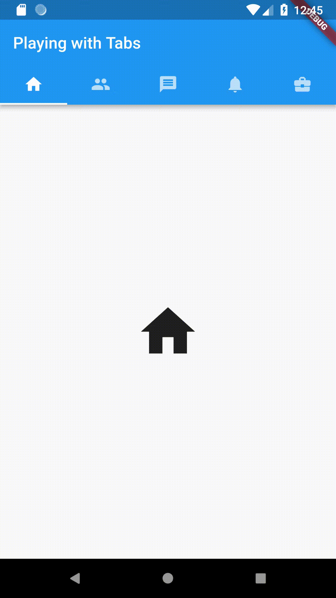
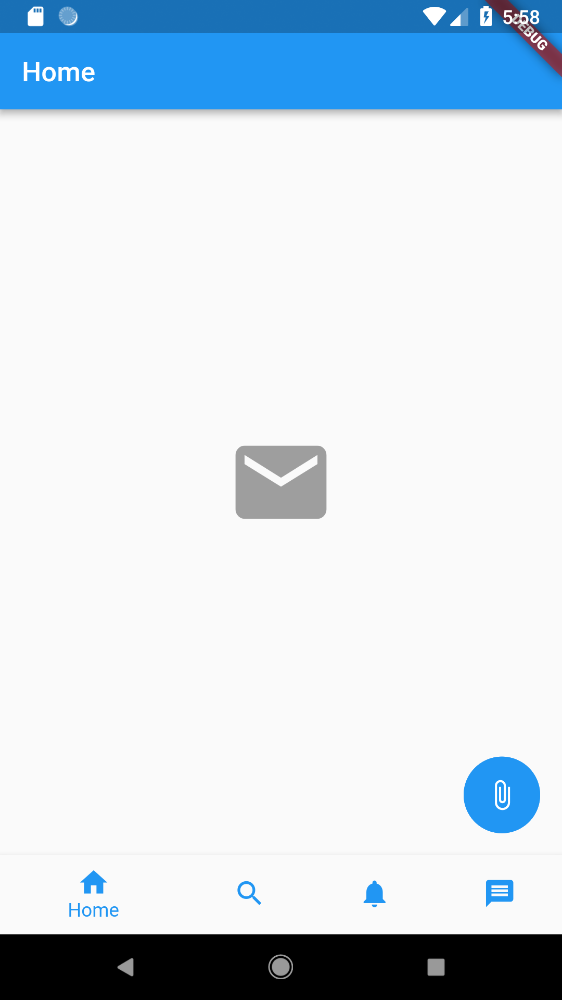
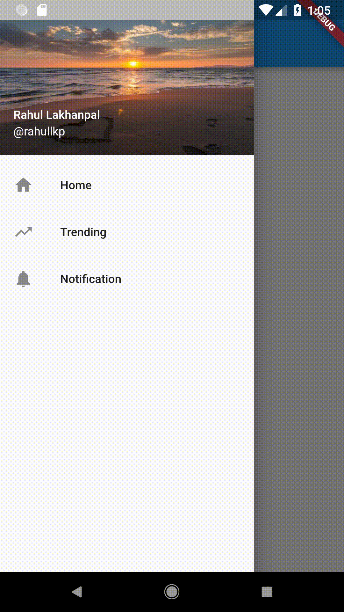

# Learning-Flutter :rocket:

A repo dedicated to learning and understanding app development with Flutter and Dart. :fire:

            

#### Installing Flutter Locally

Google has a great documentation for installing flutter on any OS. Click on the link that clearly identifies you operating system.

- [Window](https://flutter.io/setup-windows/)
- [Mac OS](https://flutter.io/setup-macos/)
- [Linux](https://flutter.io/setup-linux/)

#### IDE

I will be using VSCode for developing all my flutter apps. However, you can also use Android Studio for the same as well.
Here are the links to configure the IDEs.

- [Android Studio](https://flutter.io/get-started/editor/#androidstudio)
- [vscode](https://flutter.io/get-started/editor/#vscode)

#### Flutter Examples List

Being a flutter beginner myself, this repo will be focused on learning everything from the ground up!
Given below is a curated list of all apps that I will be developing as part of my learning-flutter jouney.

- [Day 1](hello_world/lib/main.dart) - Pleasing the gods :smiley:
- [Day 2](scaffold_sample_app/lib/main.dart) - Learning scaffolding - try 1
- [Day 3](scaffold_sample_two/lib/main.dart) - Learning scaffolding - try 2
- [Day 4](working_with_tabs/lib/main.dart) - Learning to create Tabs - try 1
- [Day 5](bottom_navigation_bar/lib/main.dart) - Learning to create Tabs - try 2
- [Day 6](handling_json_app/lib/main.dart) - Handling JSON and HTTP
- [Day 7](working_with_drawer/lib/main.dart) - Learning to create Drawer
- [Day 8](working_with_forms/lib/main.dart) - Learning to create Forms - try 1

#### Contributions

I am personally open for any contributions and improvements in my existing codebase.
Please open up an issue first, and then proceed with sending a PR for the same.
