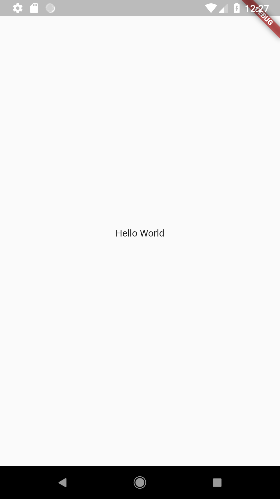

# Learning-Flutter

A repo dedicated to learning and understanding app development with Flutter and Dart. :fire:

#### Installing Flutter Locally

Google has a great documentation about getting flutter installed on your system, hence I am attaching a link for same.

- [Window](https://flutter.io/setup-windows/)
- [Mac OS](https://flutter.io/setup-macos/)
- [Linux](https://flutter.io/setup-linux/)

#### IDE

I personally have chosen VSCode to develop all my apps here. However, you may also choose android Studio for depending upon your liking.
Here are the links to configure the IDEs.

- [Android Studio](https://flutter.io/get-started/editor/#androidstudio)
- [vscode](https://flutter.io/get-started/editor/#vscode)

#### Flutter Examples List

Given below will be a curated list of all different apps that we develop using flutter.
Since I am a flutter beginner myself, hence this repo will be focused on learning this stuff from the ground up!

- [Hello World](./images/hello_world)

#### Contributions

I am personally open for any contributions and improvements in my existing codebase.
Please open up an issue first, and then proceed with sending a PR for the same.
